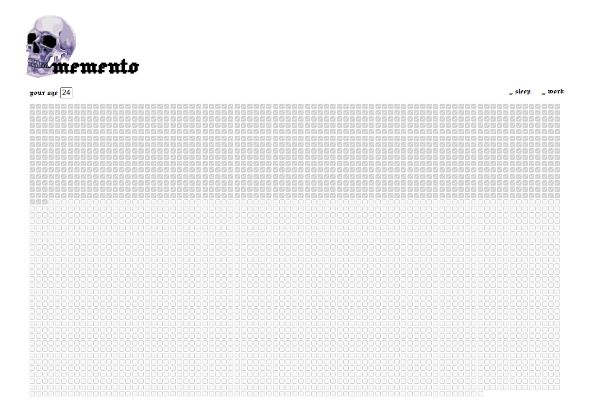

# memento

_a human spends on average [73.3 years](https://data.worldbank.org/indicator/SP.DYN.LE00.IN) on earth, 3806 weeks._

this website displays life expectancy as a grid of checkboxes, one checkbox for each week, by entering your age you can see your ETA in this life.

